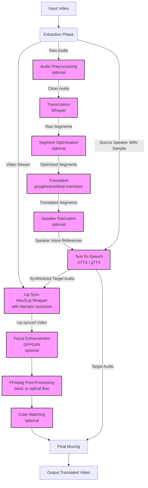

# System Architecture & Documentation

This document outlines the high-level and low-level design architectures for the **AI Video Translator**, an automated pipeline that ingests a source video, translates its spoken content into a target language with optional voice cloning, and generates a realistic lip-synced final video.

---

## 1. High-Level Design (HLD)

At a high level, the system operates as a sequential pipeline consisting of distinct stages: Input Parsing, Audio Extraction, Transcription, Translation, Text-to-Speech (with Voice Cloning), Video Generation (Lip Sync), Facial Enhancement, and Final Encoding.

### High-Level Workflow
1. **Extraction**: Initial step splits the input video into a raw video stream and an audio stream.
2. **Transcription**: The audio stream is sent to an ASR model (OpenAI's Whisper) to extract text and segment timestamps.
3. **Translation**: Audio segments are translated, accommodating for nuances in timing and speaker language.
4. **Text-To-Speech (TTS)**: Using Coqui XTTS (with fallback to gTTS), speech is synthesized. Segment timing logic stretches/pads/trims audio to match the original video speed constraints.
5. **Lip Syncing**: The synthesized target audio and original video are fed into Wav2Lip to mutate the subject's mouth to map to the new audio.
6. **Enhancement & Post-Processing**: Because Wav2Lip output can be blurry, GFPGAN can optionally restore facial features. FFmpeg runs a final cleanup filter check (denoising, sharpening).
7. **Muxing**: The enhanced visual frames and the modified target audio are integrated to export the final file.

---

## 2. Low-Level Design (LLD)

At the low level, the project is structured dynamically into several `src/*.py` modules which encapsulate unique responsibilities and dependencies. 

```mermaid
classDiagram
    class MainScript {
        +main()
        +build_arg_parser()
    }
    
    class MediaUtils {
        +ensure_ffmpeg_available()
        +ensure_cuda_available()
        +resolve_runtime_device()
        +get_media_duration()
        +extract_audio_from_video()
        +extract_voice_sample()
        +extract_audio_segment()
        +stretch_audio_to_video_duration()
        +pad_or_trim_audio_to_video_duration()
        +postprocess_video_quality()
        +mux_video_with_audio()
    }
    
    class Preprocessing {
        +preprocess_audio_for_transcription()
    }
    
    class Transcription {
        +transcribe_english_audio()
    }
    
    class Translation {
        +translate_text()
        +translate_segments()
    }
    
    class Diarization {
        +diarize_and_extract_speakers()
    }
    
    class TTS {
        +synthesize_speech()
        +synthesize_aligned_audio_from_segments()
    }
    
    class Syncing {
        +run_wav2lip_inference()
    }
    
    class Enhancement {
        +enhance_faces_in_video()
    }
    
    class Postprocessing {
        +advanced_postprocess_with_optical_flow()
        +apply_histogram_matching()
        +remove_temporal_jitter()
        +enhance_contrast_adaptive()
        +verify_lip_sync_accuracy()
    }
    
    class QualityAnalysis {
        +optimize_transcription_segments()
        +analyze_segment_pronunciation_difficulty()
        +estimate_optimal_tts_parameters()
        +VideoQualityScorer.analyze_video()
        +estimate_sync_quality_from_segments()
    }
    
    class Languages {
        +normalize_target_language()
        +format_supported_target_languages()
    }

    MainScript --> MediaUtils : File Orchestration
    MainScript --> Preprocessing : Audio cleanup
    MainScript --> Transcription : Whisper Models
    MainScript --> QualityAnalysis : Segment optimization
    MainScript --> Translation : Translation APIs
    MainScript --> Diarization : Speaker clustering
    MainScript --> TTS : XTTS/gTTS
    MainScript --> Syncing : Wav2Lip subprocess
    MainScript --> Enhancement : Face enhancement
    MainScript --> Postprocessing : Optical flow & color matching
    MainScript --> Languages : Language validation
```

### Core Components Details

- **`src.media_utils`**: Wraps FFmpeg command-line interface. Handles extracting audio tracks, time-slicing WAV files, stretching audio, duration alignment (trim/pad), and video-audio muxing.
- **`src.preprocessing`**: Provides speech audio preprocessing (spectral denoising, Butterworth bandpass filtering, dynamic range compression, LUFS loudness normalization) to maximize transcription accuracy.
- **`src.transcription`**: Interfaces with OpenAI's Whisper models to transcribe input audio and return segment dictionaries with timestamp data.
- **`src.quality_analysis`**: Implements segment optimization (filters low-confidence, splits long, merges short segments) and handles video/sync quality scoring.
- **`src.translation`**: Handles communication with Google Translate endpoints using `googletrans` and a backup deep-translator framework, with segment alignment tracking.
- **`src.diarization`**: Uses XTTS voice latents to cluster speakers, enabling speaker voice cloning for multi-speaker dialogues.
- **`src.tts`**: Integrates Coqui XTTS v2 with gTTS fallback. Synthesizes aligned speech using time-stretching and padding/offset calculations.
- **`src.syncing`**: Wraps the Wav2Lip system as a progress-tracked subprocess. Handles custom arguments including face crop, bounding box, rotation, and narrator exclusion intervals.
- **`src.enhancement`**: Employs GFPGAN to enhance and restore blurry faces in Wav2Lip output frames.
- **`src.postprocessing`**: Applies basic FFmpeg postprocessing or advanced optical flow temporal smoothing, LAB color space histogram matching, temporal jitter removal, and CLAHE adaptive contrast.
- **`src.languages`**: Normalizes and validates user-specified target language codes or names against supported codes.

---

## 3. Deployment & Settings

### Python Environment Dependencies
Given library shifts (specifically Coqui TTS native requirements and newer Pytorch torchvision structures), the system operates across environment bounds:
- **Recommended Environment:** Python 3.12+ (Represented by `venv312`) 
- Heavy TTS cloning uses `venv311` fallback due to strict C++ Coqui dependency requirements on Windows.

### Configuration Argument Summary
The behavior is heavily modified via `main.py` CLI arguments:
- **Timing** (`--timing_mode`): Controls whether timing stretches global streams or individually resynthesizes segment-by-segment (aligning exact clips on original start markers).
- **TTS Strictness** (`--tts_backend_policy`): `strict_clone` | `fallback_allowed` | `fallback_only`.
- **Post-Processing Variables**: 
  - `--postprocess_denoise_strength`
  - `--postprocess_sharpen_amount`
  - `--postprocess_contrast`, `--postprocess_saturation`
  - `--postprocess_crf`, `--postprocess_preset`