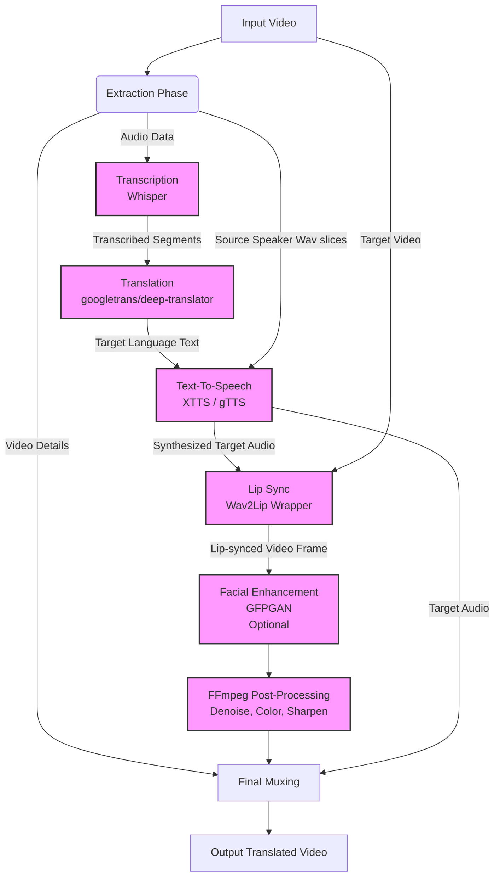
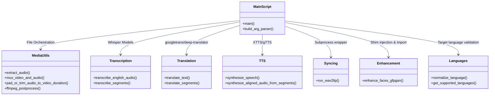

# System Architecture & Documentation

This document outlines the high-level and low-level design architectures for the **AI Video Translator**, an automated pipeline that ingests a source video, translates its spoken content into a target language with optional voice cloning, and generates a realistic lip-synced final video.

---

## 1. High-Level Design (HLD)

At a high level, the system operates as a sequential pipeline consisting of distinct stages: Input Parsing, Audio Extraction, Transcription, Translation, Text-to-Speech (with Voice Cloning), Video Generation (Lip Sync), Facial Enhancement, and Final Encoding.

### High-Level Workflow
1. **Extraction**: Initial step splits the input video into a raw video stream and an audio stream.
2. **Transcription**: The audio stream is sent to an ASR model (OpenAI's Whisper) to extract text and segment timestamps.
3. **Translation**: Audio segments are translated, accommodating for nuances in timing and speaker language.
4. **Text-To-Speech (TTS)**: Using Coqui XTTS (with fallback to gTTS), speech is synthesized. Segment timing logic stretches/pads/trims audio to match the original video speed constraints.
5. **Lip Syncing**: The synthesized target audio and original video are fed into Wav2Lip to mutate the subject's mouth to map to the new audio.
6. **Enhancement & Post-Processing**: Because Wav2Lip output can be blurry, GFPGAN can optionally restore facial features. FFmpeg runs a final cleanup filter check (denoising, sharpening).
7. **Muxing**: The enhanced visual frames and the modified target audio are integrated to export the final file.

---

## 2. Low-Level Design (LLD)

At the low level, the project is structured dynamically into several `src/*.py` modules which encapsulate unique responsibilities and dependencies. 

### Core Components Details

- **`src.media_utils`**: Heavily dependent on `subprocess` scaling the command line API of `ffmpeg`. Responsible for length adjustment (e.g., `rate = source_audio_duration / target_video_duration`). Contains the post-process execution.
- **`src.transcription`**: Calls and loads Whisper models. Processes raw input paths and abstracts ASR API responses into iterable dictionaries representing line-by-line segments with `start` and `end` timings.
- **`src.translation`**: Handles external network requests to translation APIs. Supports fallback stacks relying on `googletrans` or `deep-translator`.
- **`src.tts`**: Employs backend exception handling structure (`XTTSUnavailableError`, `XTTSRuntimeSynthesisError`, etc.). Employs a `--tts_backend_policy` to distinguish between strict cloning pipelines vs. simple gTTS fallback if users don't have Coqui installed on newer platforms or Windows systems failing C++ tooling. 
- **`src.syncing`**: Wraps the `Wav2Lip/inference.py` environment. Monitors subprocess stdout via `tqdm` to capture pipeline progression, outputting temp video files. Uses explicit `x264` settings (`-preset slow -crf 16`) for better export quality than legacy Wav2Lip.
- **`src.enhancement`**: Handles conditional imports and Torch monkeypatching (such as `torchvision.transforms.functional_tensor`) required for GFPGAN loading on newer PyTorch versions.
- **`src.languages`**: Small helper dictionary and normalization script ensuring flags like `--target_language fr` equates perfectly for translation endpoints and internal prompts as `french`.

---

## 3. Deployment & Settings

### Python Environment Dependencies
Given library shifts (specifically Coqui TTS native requirements and newer Pytorch torchvision structures), the system operates across environment bounds:
- **Recommended Environment:** Python 3.12+ (Represented by `venv312`) 
- Heavy TTS cloning uses `venv311` fallback due to strict C++ Coqui dependency requirements on Windows.

### Configuration Argument Summary
The behavior is heavily modified via `main.py` CLI arguments:
- **Timing** (`--timing_mode`): Controls whether timing stretches global streams or individually resynthesizes segment-by-segment (aligning exact clips on original start markers).
- **TTS Strictness** (`--tts_backend_policy`): `strict_clone` | `fallback_allowed` | `fallback_only`.
- **Post-Processing Variables**: 
  - `--postprocess_denoise_strength`
  - `--postprocess_sharpen_amount`
  - `--postprocess_contrast`, `--postprocess_saturation`
  - `--postprocess_crf`, `--postprocess_preset`